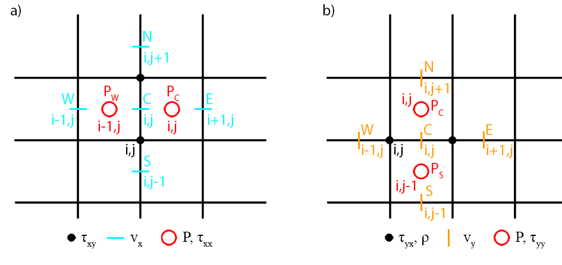
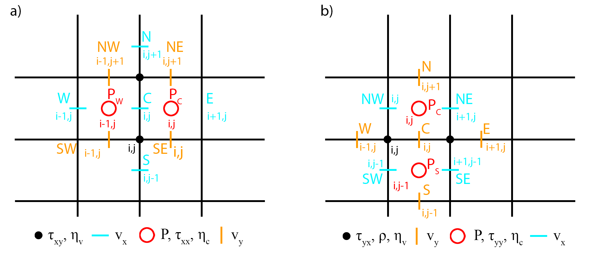
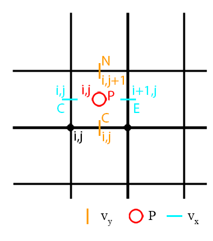
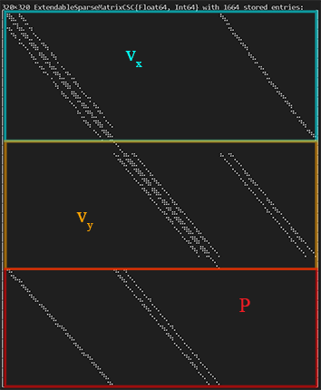
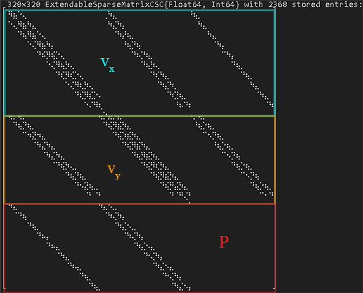

# Stokes Equation (2D)

The Stokes equation in two dimensions is defined as:

$\begin{equation}
0 = -\frac{\partial{P}}{\partial{x_i}} + \frac{\partial{\tau_{ij}}}{\partial{x_j}} + \rho g_i, 
\end{equation}$

where $P$ is the total pressure [Pa], $\rho$ is the density [kg/m³], $g_i$ is the gravitational acceleration [m/s²], $\frac{\partial}{\partial x_i}$ is the spatial derivative in the $x_i$-direction, and $\tau_{ij}$ is the deviatoric stress tensor [Pa], defined as:

$\begin{equation}
\tau_{ij} = 2\eta \dot{\varepsilon}_{ij}, 
\end{equation}$

where $\eta$ is the dynamic viscosity [Pa·s], and $\dot{\varepsilon}_{ij}$ is the strain-rate tensor [1/s], given by:

$\begin{equation}
\dot{\varepsilon}_{ij} = \frac{1}{2} \left( \frac{\partial{v_i}}{\partial{x_j}} + \frac{\partial{v_j}}{\partial{x_i}} \right),
\end{equation}$

where $v_i$ is the velocity [m/s] in the $i$-th direction.

The Stokes equation provides two equations for three unknowns: $v_x$, $v_y$, and $P$. To solve for the third unknown, one additional equation is required — the **mass conservation equation**.

The conservation of mass (assuming an incompressible medium) is defined as:

$\begin{equation}
\text{div}\left(\vec{v} \right) = \left(\frac{\partial{v_i}}{\partial{x_i}}+\frac{\partial{v_j}}{\partial{x_j}}\right) = 0.
\end{equation}$ 

# Discretization 

The conservation equations of **momentum** and **mass** are solved in two dimensions ($x$ and $y$) using a **staggered finite difference grid**, where the horizontal (cyan dashes) and vertical (orange dashes) velocities are defined between the regular grid points (vertices), and the pressure (red circles) within finite difference cells (centroids), as shown in Figure 1.

A staggered grid enables conservation of stress between adjacent grid points and requires careful placement of the associated variables.

**Figure 1. Staggered finite difference grid for the momentum equation.**  
Discretization of the conservation equations of momentum and mass. The horizontal and vertical velocities require *ghost nodes* at the North, South, East, and West boundaries, respectively.

---------------------
---------------------

# Constant Viscosity

Let's first assume a special case of the Stokes equation, a **constant viscosity**, which simplifies equation (1) to:

$\begin{equation}
0 = -\frac{\partial{P}}{\partial{x_i}} + 2\eta\frac{\partial^2{v_i}}{\partial{x_i^2}} + \eta\left(\frac{\partial^2{v_i}}{\partial{x_j^2}}+\frac{\partial^2{v_j}}{\partial{x_i^2}}\right) + \rho g_i. 
\end{equation}$

By applying equation (4) and neglecting horizontal gravitational acceleration, equation (5) simplifies to the following component-wise forms:

**$x$-component** 

$\begin{equation}
-\frac{\partial{P}}{\partial{x}} + \eta\frac{\partial^2{v_x}}{\partial{x^2}} + \eta\frac{\partial^2{v_x}}{\partial{y^2}} = 0, 
\end{equation}$

**$y$-component**

$\begin{equation}
-\frac{\partial{P}}{\partial{y}} + \eta\frac{\partial^2{v_y}}{\partial{y^2}} + \eta\frac{\partial^2{v_y}}{\partial{x^2}} = - \rho g_y. 
\end{equation}$

To discretize these equations, we define a **numerical stencil** indicating the grid points involved in the finite difference approximation. Each stencil is centered on the point $(i,j)$, where $i$ and $j$ denote indices in the horizontal and vertical directions, respectively. The central point corresponds to the equation's location in the global linear system.

## Stencil

The numerical stencils for the momentum equations under constant viscosity are shown in Figure 2. These stencils illustrate the neighboring grid points required to evaluate each component using a finite difference scheme.

**Figure 2. Numerical stencils for constant viscosity.** a) *$x$-component*; b) *$y$-component*.

By applying finite difference approximations to the partial derivatives, equations (6) and (7) become:

**$x$-component**

$\begin{equation}\begin{gather*}
& -\frac{P_{i,j}-P_{i-1,j}}{\Delta{x}} + \\ & \eta\frac{v_{x,(i-1,j)}-2v_{x,(i,j)}+v_{x,(i+1,j)}}{\Delta{x^2}} + \\ &  \eta\frac{v_{x,(i,j-1)}-2v_{x,(i,j)}+v_{x,(i,j+1)}}{\Delta{y^2}} = 0.
\end{gather*}\end{equation}$

Rearranging and grouping terms, we obtain:

$\begin{equation}\begin{gather*}
& P_CP_{i,j} + P_WP_{i-1,j} + \\ & Sv_{x,(i,j-1)} +  Wv_{x,(i-1,j)} + \\ & Cv_{x,(i,j)} + \\ & E v_{x,(i+1,j)} + N v_{x,(i,j+1)} = 0, 
\end{gather*}\end{equation}$

where the coefficients are defined as:

$\begin{equation}
\begin{split}
P_C & = -\frac{1}{\Delta{x}},  \\
P_W & = \frac{1}{\Delta{x}}, \\
S & = \frac{\eta}{\Delta{y^2}}, \\
W & = \frac{\eta}{\Delta{x^2}}, \\
C & = -2\eta\left(\frac{1}{\Delta{x^2}}+\frac{1}{\Delta{y^2}}\right), \\
E & = \frac{\eta}{\Delta{x^2}}, \\
N & = \frac{\eta}{\Delta{y^2}}. \\
\end{split}
\end{equation}$

**$y$-component**

$\begin{equation}\begin{gather*}
& -\frac{P_{i,j}-P_{i,j-1}}{\Delta{y}} + \\ & \eta\frac{v_{y,(i,j-1)}-2v_{y,(i,j)}+v_{x,(i,j+1)}}{\Delta{y^2}} + \\ & \eta\frac{v_{y,(i-1,j)}-2v_{y,(i,j)}+v_{y,(i+1,j)}}{\Delta{x^2}} = \\ & -\frac{\rho_{i,j}+\rho_{i+1,j}}{2} g_y.
\end{gather*}\end{equation}$

Rearranging and grouping terms, we obtain:

$\begin{equation}\begin{gather*}
& P_SP_{i,j-1} + P_CP_{i,j} + \\ & Sv_{y,(i,j-1)} + Wv_{y,(i-1,j)} + \\ & Cv_{y,(i,j)} + \\ & E v_{y,(i+1,j)} + N v_{y,(i,j+1)} = \\ & -\frac{\rho_{i,j}+\rho_{i+1,j}}{2} g_y, 
\end{gather*}\end{equation}$

with coefficients defined as:

$\begin{equation}
\begin{split}
P_S & = \frac{1}{\Delta{y}},  \\
P_C & = -\frac{1}{\Delta{y}}, \\
S & = \frac{\eta}{\Delta{y^2}}, \\
W & = \frac{\eta}{\Delta{x^2}}, \\
C & = -2\eta\left(\frac{1}{\Delta{x^2}}+\frac{1}{\Delta{y^2}}\right), \\
E & = \frac{\eta}{\Delta{x^2}}, \\
N & = \frac{\eta}{\Delta{y^2}}. \\
\end{split}
\end{equation}$

## Boundary Conditions

The most commonly applied boundary conditions for the momentum equation are combinations of *Dirichlet* and *Neumann* velocity boundary conditions. These are typically referred to as **free slip** and **no slip** boundary conditions.

---------------------

### Free slip 

Free slip boundary conditions allow fluid motion along the boundary while enforcing **zero shear stress** and **no flow across** the boundary. For the lateral boundaries (East, West), this translates to:

$\begin{equation}
\begin{split}
v_x = 0, \\
\frac{\partial{v_{y}}}{\partial{x}}=0.
\end{split}
\end{equation}$

For the horizontal boundaries (North, South), the conditions are:

$\begin{equation}
\begin{split}
v_y = 0, \\
\frac{\partial{v_{x}}}{\partial{y}}=0.
\end{split}
\end{equation}$

When solving the momentum equation using a direct method, the system coefficients near the domain boundaries must be modified to account for these conditions. This involves specifying velocity values at *ghost nodes* and, if applicable, updating the right-hand side of the equations.

**$x$-component**

For the free slip condition, the horizontal velocity $v_x$ at the ghost nodes along the South and North boundaries is defined as:

*South*

$\begin{equation}
v_{x,(i,GS)} = v_{x,(i,1)},
\end{equation}$

*North*

$\begin{equation}
v_{x,(i,GN)} = v_{x,(i,ncy)}.
\end{equation}$

At the lateral boundaries (East, West), the horizontal velocity is set to zero.

**$y$-component**

The vertical velocity $v_y$ at the ghost nodes for the West and East boundaries is defined as:

*West*

$\begin{equation}
v_{y,(GW,j)} = v_{y,(1,j)},
\end{equation}$

*East*

$\begin{equation}
v_{y,(GE,j)} = v_{y,(ncx,j)}.
\end{equation}$

Along the North and South boundaries, $v_y$ is set to zero.

Using equations (16) – (19), the discretized system of equations is updated accordingly. For free slip boundaries, the right-hand side remains unchanged, but the coefficients are modified.

**$x$-component**

*South*

$\begin{equation}\begin{gather*}
& P_WP_{i-1,j}+P_CP_{i,j}+ \\ & Wv_{x,(i-1,j)}+ \\ & Cv_{x,(i,j)}+ \\ & Ev_{x,(i+1,j)}+Nv_{x,(i,j+1)} = 0,
\end{gather*}\end{equation}$

with 

$\begin{equation}C = -\frac{2\eta}{\Delta{x^2}}-\frac{\eta}{\Delta{y^2}}.\end{equation}$

*North*

$\begin{equation}\begin{gather*}
& P_WP_{i-1,j}+P_CP_{i,j}+ \\ & Sv_{x,(i,j-1)}+ Wv_{x,(i-1,j)}+ \\ & Cv_{x,(i,j)}+ \\ & Ev_{x,(i+1,j)} = 0,
\end{gather*}\end{equation}$

with 

$\begin{equation}C = -\frac{2\eta}{\Delta{x^2}}-\frac{\eta}{\Delta{y^2}}.\end{equation}$

On the lateral boundaries (East, West), the central coefficient is set to:

$\begin{equation}
C = 1,
\end{equation}$

and all other coefficients are set to zero.

**$y$-component**

*West*

$\begin{equation}\begin{gather*}
& P_SP_{i,j-1}+P_CP_{i,j}+ \\ & Sv_{y,(i,j-1)}+ \\ & Cv_{y,(i,j)}+ \\ & Ev_{y,(i+1,j)}+ Nv_{y,(i,j+1)} = \\ & -\frac{\rho_{i,j}+\rho_{i+1,j}}{2} g_y,
\end{gather*}\end{equation}$

with 

$\begin{equation}C = -\frac{\eta}{\Delta{x^2}}-\frac{2\eta}{\Delta{y^2}}.\end{equation}$

*East*

$\begin{equation}\begin{gather*}
& P_SP_{i,j-1}+P_CP_{i,j}+ \\ & Sv_{y,(i,j-1)}+ Wv_{y,(i-1,j)}+ \\ & Cv_{y,(i,j)}+ \\ & Nv_{y,(i,j+1)} = \\ & -\frac{\rho_{i,j}+\rho_{i+1,j}}{2} g_y,
\end{gather*}\end{equation}$

with 

$\begin{equation}C = -\frac{\eta}{\Delta{x^2}}-\frac{2\eta}{\Delta{y^2}}.\end{equation}$

On the North and South boundaries, the central coefficient is:

$\begin{equation}
C = 1,
\end{equation}$

and all other coefficients are zero.

--------------

### No slip

No slip boundary conditions enforce zero velocity along the boundary, effectively "fixing" the fluid to the boundary. That is, for all boundaries (East, West, South, North), the velocity components satisfy:

$\begin{equation}
\begin{split}
v_x = 0, \\
v_y = 0.
\end{split}
\end{equation}$

**$x$-component**

For the horizontal velocity $v_x$, values at the ghost nodes adjacent to the South and North boundaries are defined as:

*South*

$\begin{equation}
v_{x,(i,GS)} = 2V_{BC,S} - v_{x,(i,1)},
\end{equation}$

*North*

$\begin{equation}
v_{x,(i,GN)} = 2V_{BC,N} - v_{x,(i,ncy)},
\end{equation}$

where $V_{BC,S}$ and $V_{BC,N}$ are the prescribed boundary velocities (typically zero for no slip).

At the lateral boundaries (East, West), the velocity $v_x$ is simply set to zero, as in the free slip case.

**$y$-component**

For the vertical velocity $v_y$, the ghost nodes adjacent to the West and East boundaries are defined as:

*West*

$\begin{equation}
v_{y,(GW,j)} = 2V_{BC,W} - v_{y,(1,j)},
\end{equation}$

*East*

$\begin{equation}
v_{y,(GE,j)} = 2V_{BC,E} - v_{y,(ncx,j)},
\end{equation}$

where $V_{BC,W}$ and $V_{BC,E}$ are the prescribed boundary velocities (again typically zero).

Along the North and South boundaries, $v_y = 0$ directly, consistent with the free slip implementation.

Using equations (31) – (34), the system coefficients and the right-hand side of the discretized equations are modified accordingly.

**$x$-component**

*South*

$\begin{equation}\begin{gather*}
& P_WP_{i-1,j}+P_CP_{i,j}+ \\ & Wv_{x,(i-1,j)}+ \\ & Cv_{x,(i,j)}+ \\ & Ev_{x,(i+1,j)}+Nv_{x,(i,j+1)} = \\ & -2\frac{\eta}{\Delta{y^2}}V_{BC,S},
\end{gather*}\end{equation}$

with 

$\begin{equation}C = -\frac{2\eta}{\Delta{x^2}}-\frac{3\eta}{\Delta{y^2}}.\end{equation}$

*North*

$\begin{equation}\begin{gather*}
& P_WP_{i-1,j}+P_CP_{i,j}+ \\ & Sv_{x,(i,j-1)}+Wv_{x,(i-1,j)}+ \\ & Cv_{x,(i,j)}+ \\ & Ev_{x,(i+1,j)} = \\ & -2\frac{\eta}{\Delta{y^2}}V_{BC,N},
\end{gather*}\end{equation}$

with 

$\begin{equation}C = -\frac{2\eta}{\Delta{x^2}}-\frac{3\eta}{\Delta{y^2}}.\end{equation}$

On the lateral boundaries (East, West), set:

$\begin{equation}
C = 1,
\end{equation}$

with all other coefficients and the right-hand side equal to zero.

**$y$-component**

*West*

$\begin{equation}\begin{gather*}
& P_SP_{i,j-1}+P_CP_{i,j}+ \\ & Sv_{y,(i,j-1)}+ \\ & Cv_{y,(i,j)}+ \\ & Ev_{y,(i+1,j)}+Nv_{y,(i,j+1)} = \\ & -\frac{\rho_{i,j} + \rho_{i+1,j}}{2} g_y - 2\frac{\eta}{\Delta{x^2}}V_{BC,W},
\end{gather*}\end{equation}$

with 

$\begin{equation}C = -\frac{3\eta}{\Delta{x^2}}-\frac{2\eta}{\Delta{y^2}}.\end{equation}$

*East*

$\begin{equation}\begin{gather*}
& P_SP_{i,j-1}+P_CP_{i,j}+ \\ & Sv_{y,(i,j-1)}+Wv_{y,(i-1,j)}+ \\ & Cv_{y,(i,j)}+ \\ & Nv_{y,(i,j+1)} = \\ & -\frac{\rho_{i,j} + \rho_{i+1,j}}{2} g_y - 2\frac{\eta}{\Delta{x^2}}V_{BC,W},
\end{gather*}\end{equation}$

with 

$\begin{equation}C = -\frac{3\eta}{\Delta{x^2}}-\frac{2\eta}{\Delta{y^2}}.\end{equation}$

On the horizontal boundaries (North, South), set:

$\begin{equation}
C = 1,
\end{equation}$

and all other coefficients and the right-hand side to zero.

For implementation details, please refer to the [source code](https://github.com/GeoSci-FFM/GeoModBox.jl/blob/main/src/MomentumEquation/2Dsolvers.jl).

-------------
-------------

# Variable Viscosity

In the case of variable viscosity, the momentum equation is written in terms of the unknowns as follows:

**$x$-component**

$\begin{equation}
-\frac{\partial{P}}{\partial{x}} + \frac{\partial{}}{\partial{x}}\left(2\eta_c\frac{\partial{v_x}}{\partial{x}}\right)+\frac{\partial{}}{\partial{y}}\left( \eta_v\left(\frac{\partial{v_x}}{\partial{y}} + \frac{\partial{v_y}}{\partial{x}}\right)\right) = 0,
\end{equation}$

**$y$-component**

$\begin{equation}
-\frac{\partial{P}}{\partial{y}} + \frac{\partial{}}{\partial{y}}\left(2\eta_c\frac{\partial{v_y}}{\partial{y}}\right)+\frac{\partial{}}{\partial{x}}\left( \eta_v\left(\frac{\partial{v_y}}{\partial{x}} + \frac{\partial{v_x}}{\partial{y}}\right)\right) = -\frac{\rho_{i,j}+\rho_{i+1,j}}{2}g_y,
\end{equation}$

where $\eta_c$ denotes the viscosity defined at the *centroids*, and $\eta_v$ denotes the viscosity defined at the *vertices*.

## Stencil

The stencils for the momentum equation assuming variable viscosity illustrate the grid points (parameters) required to solve the equations for each velocity component using a finite difference discretization (Figure 3).

**Figure 3.** **Numerical stencils for variable viscosity.** a) *$x$-component*; b) *$y$-component*.  

> **Note**: In the following equations, the indices $(i,j)$ of each variable $\left(v_x, v_y, P, \eta_c, \eta_v\right)$ refer to the central point of the respective stencil, as depicted in Figure 3. 

Using finite difference approximations, the momentum equation is expressed as:

**$x$-component**

$\begin{equation}
-\frac{P_{i,j}-P_{i-1,j}}{\Delta{x}}+\frac{\tau_{xx,(i,j)} -\tau_{xx,(i-1,j)}}{\Delta{x}} + \frac{\tau_{xy,(i,j+1)}-\tau_{xy,(i,j)}}{\Delta{y}} = 0,
\end{equation}$

or, explicitly in terms of partial derivatives:

$\begin{equation}\begin{gather*}
& -\frac{P_{i,j}-P_{i-1,j}}{\Delta{x}}+\\ & \frac{2\eta_{c,(i,j)}\frac{\partial{v_x}}{\partial{x}}\vert_{i,j} -2\eta_{c,(i-1,j)}\frac{\partial{v_x}}{\partial{x}}\vert_{i-1,j}}{\Delta{x}} + \\ & \frac{\eta_{v,(i,j+1)}\left(\frac{\partial{v_x}}{\partial{y}}\vert_{i,j+1}+\frac{\partial{v_y}}{\partial{x}}\vert_{i,j+1}\right)-\eta_{v,(i,j)}\left(\frac{\partial{v_x}}{\partial{y}}\vert_{i,j}+\frac{\partial{v_y}}{\partial{x}}\vert_{i,j}\right)}{\Delta{y}} = 0,
\end{gather*}\end{equation}$

and in terms of the discrete velocity unknowns:

$\begin{equation}\begin{gather*}
& -\frac{P_{i,j}-P_{i-1,j}}{\Delta{x}}+ \\ & \frac{2\eta_{c,(i,j)}}{\Delta{x}}\left(\frac{v_{x,(i+1,j)}-v_{x,(i,j)}}{\Delta{x}}\right) - \\ & \frac{2\eta_{c,(i-1,j)}}{\Delta{x}}\left(\frac{v_{x,(i,j)}-v_{x,(i-1,j)}}{\Delta{x}}\right)+ \\ & \frac{\eta_{v,(i,j+1)}}{\Delta{y}}\left(\frac{v_{x,(i,j+1)}-v_{x,(i,j)}}{\Delta{y}} + \frac{v_{y,(i,j+1)}-v_{y,(i-1,j+1)}}{\Delta{x}}\right) - \\ &  \frac{\eta_{v,(i,j)}}{\Delta{y}}\left(\frac{v_{x,(i,j)}-v_{x,(i,j-1)}}{\Delta{y}} + \frac{v_{y,(i,j)}-v_{y,(i-1,j)}}{\Delta{x}}\right) = 0.
\end{gather*}\end{equation}$

Reorganizing terms yields:

$\begin{equation}\begin{gather*}
& P_WP_{i-1,j}+P_CP_{i,j} + \\ & Sv_{x,(i,j-1)}+SWv_{y,(i-1,j)}+SEv_{y,(i,j)}+Wv_{x,(i-1,j)}+ \\ & Cv_{x,(i,j)} + \\ & Ev_{x,(i+1,j)} + NWv_{y,(i-1,j+1)} + NEv_{y,(i,j+1)} + Nv_{x,(i,j+1)} = \\ & 0, 
\end{gather*}\end{equation}$

with coefficients defined as:

$\begin{equation}\begin{split}
P_W & = \frac{1}{\Delta{x}} ,\\
P_C & = -\frac{1}{\Delta{x}}, \\
S & = \frac{\eta_{v,(i,j)}}{\Delta{y^2}},\\
SW & = \frac{\eta_{v,(i,j)}}{\Delta{x}\Delta{y}},\\
SE & = -\frac{\eta_{v,(i,j)}}{\Delta{x}\Delta{y}},\\
W & = \frac{2\eta_{c,(i-1,j)}}{\Delta{x^2}},\\
C & = -\frac{2}{\Delta{x^2}}\left(\eta_{c,(i,j)}+\eta_{c,(i-1,j)}\right)-\frac{1}{\Delta{y^2}}\left(\eta_{v,(i,j+1)} + \eta_{v,(i,j)} \right), \\
E & = \frac{2\eta_{c,(i,j)}}{\Delta{x^2}},\\
NW & = -\frac{\eta_{v,(i,j+1)}}{\Delta{x}\Delta{y}},\\
NE & = \frac{\eta_{v,(i,j+1)}}{\Delta{x}\Delta{y}},\\
N & = \frac{\eta_{v,(i,j+1)}}{\Delta{y^2}}.\\
\end{split}\end{equation}$

**$y$-component**

$\begin{equation}
-\frac{P_{i,j}-P_{i,j-1}}{\Delta{y}}+\frac{\tau_{yy,(i,j)} - \tau_{yy,(i,j-1)}}{\Delta{y}} + \frac{\tau_{yx,(i+1,j)}-\tau_{yx,(i,j)}}{\Delta{x}} = -\frac{\rho_{i,j}+\rho_{i+1,j}}{2} g_y,
\end{equation}$

or, expanded:

$\begin{equation}\begin{gather*}
& -\frac{P_{i,j}-P_{i,j-1}}{\Delta{y}}+ \\ & \frac{2\eta_{c,(i,j)}\frac{\partial{v_y}}{\partial{y}}\vert_{i,j} -2\eta_{c,(i,j-1)}\frac{\partial{v_y}}{\partial{y}}\vert_{i,j-1}}{\Delta{y}} + \\ & \frac{\eta_{v,(i+1,j)}\left(\frac{\partial{v_y}}{\partial{x}}\vert_{i+1,j}+\frac{\partial{v_x}}{\partial{y}}\vert_{i+1,j}\right)-\eta_{v,(i,j)}\left(\frac{\partial{v_y}}{\partial{x}}\vert_{i,j}+\frac{\partial{v_x}}{\partial{y}}\vert_{i,j}\right)}{\Delta{x}} = \\ & -\frac{\rho_{i,j}+\rho_{i+1,j}}{2} g_y,
\end{gather*}\end{equation}$

which becomes in discrete form:

$\begin{equation}\begin{gather*}
& -\frac{P_{i,j}-P_{i,j-1}}{\Delta{y}}+ \\ & \frac{2\eta_{c,(i,j)}}{\Delta{y}}\left(\frac{v_{y,(i,j+1)}-v_{y,(i,j)}}{\Delta{y}}\right) - \\ & \frac{2\eta_{c,(i,j-1)}}{\Delta{y}}\left(\frac{v_{y,(i,j)}-v_{y,(i,j-1)}}{\Delta{y}}\right)+ \\ & \frac{\eta_{v,(i+1,j)}}{\Delta{x}}\left(\frac{v_{y,(i+1,j)}-v_{y,(i,j)}}{\Delta{x}} + \frac{v_{x,(i+1,j)}-v_{x,(i+1,j-1)}}{\Delta{y}}\right) - \\ & \frac{\eta_{v,(i,j)}}{\Delta{x}}\left(\frac{v_{y,(i,j)}-v_{y,(i-1,j)}}{\Delta{x}} + \frac{v_{x,(i,j)}-v_{x,(i,j-1)}}{\Delta{y}}\right) = \\ & -\frac{\rho_{i,j}+\rho_{i+1,j}}{2} g_y.
\end{gather*}\end{equation}$

Reorganized:

$\begin{equation}\begin{gather*}
& P_CP_{i,j}+P_SP_{i,j-1} + \\ & Sv_{y,(i,j-1)}+SWv_{x,(i,j-1)}+SEv_{x,(i+1,j-1)}+Wv_{y,(i-1,j)}+ \\ & Cv_{y,(i,j)} + \\ & Ev_{y,(i+1,j)} + NWv_{x,(i,j)} + NEv_{x,(i+1,j)} + Nv_{y,(i,j+1)} = \\ & -\frac{\rho_{i,j}+\rho_{i+1,j}}{2} g_y, 
\end{gather*}\end{equation}$

with coefficients:

$\begin{equation}\begin{split}
P_S & = \frac{1}{\Delta{y}}, \\
P_C & = -\frac{1}{\Delta{y}}, \\
S & = \frac{2\eta_{c,(i,j-1)}}{\Delta{y^2}},\\
SW & = \frac{\eta_{v,(i,j)}}{\Delta{x}\Delta{y}},\\
SE & = -\frac{\eta_{v,(i+1,j)}}{\Delta{x}\Delta{y}},\\
W & = \frac{\eta_{v,(i,j)}}{\Delta{x^2}},\\
C & = -\frac{2}{\Delta{y^2}}\left(\eta_{c,(i,j)}+\eta_{c,(i,j-1)}\right)-\frac{1}{\Delta{x^2}}\left(\eta_{v,(i+1,j)} + \eta_{v,(i,j)} \right), \\
E & = \frac{\eta_{v,(i+1,j)}}{\Delta{x^2}},\\
NW & = -\frac{\eta_{v,(i,j)}}{\Delta{x}\Delta{y}},\\
NE & = \frac{\eta_{v,(i+1,j)}}{\Delta{x}\Delta{y}},\\
N & = \frac{2\eta_{c,(i,j)}}{\Delta{y^2}}.\\
\end{split}\end{equation}$

## Boundary Conditions

The velocities for the ghost nodes used to define the various velocity boundary conditions are the same as described for the constant viscosity case.

---

### Free Slip

Using equations (16)–(19), the coefficients of the equations adjacent to the corresponding boundaries are modified accordingly. Note that the right-hand side does **not** change for free slip boundary conditions.

**$x$-component**

*South*

$\begin{equation}\begin{gather*}
& P_WP_{i-1,j}+P_CP_{i,j} +\\ & SWv_{y,(i-1,j)}+SEv_{y,(i,j)}+Wv_{x,(i-1,j)}+\\ & Cv_{x,(i,j)}+\\ & Ev_{x,(i+1,j)}+NWv_{y,(i-1,j+1)}+NEv_{y,(i,j+1)}+Nv_{x,(i,j+1)} = 0,
\end{gather*}\end{equation}$

with 

$\begin{equation}C = -\frac{2}{\Delta{x^2}} \left( \eta_{c,(i,j)} + \eta_{c,(i-1,j)} \right) - \frac{\eta_{v,(i,j+1)}}{\Delta{y^2}}.\end{equation}$

*North*

$\begin{equation}\begin{gather*}
& P_WP_{i-1,j}+P_CP_{i,j}+\\ & Sv_{x,(i,j-1)}+SWv_{y,(i-1,j)}+SEv_{y,(i,j)}+Wv_{x,(i-1,j)}+\\ & Cv_{x,(i,j)}+ \\ & Ev_{x,(i+1,j)}+NWv_{y,(i-1,j+1)}+NEv_{y,(i,j+1)} = 0,
\end{gather*}\end{equation}$

with 

$\begin{equation}C = -\frac{2}{\Delta{x^2}}\left(\eta_{c,(i,j)}+\eta_{c,(i-1,j)}\right)-\frac{\eta_{v,(i,j)}}{\Delta{y^2}}.\end{equation}$

Along the lateral boundaries (East, West), the central coefficient is set to:

$\begin{equation}
C = 1,
\end{equation}$

and all other coefficients are set to zero.

**$y$-component**

*West* 

$\begin{equation}\begin{gather*}
& P_CP_{i,j}+P_SP_{i,j-1} + \\ & Sv_{y,(i,j-1)} + SWv_{x,(i,j-1)} + SEv_{x,(i+1,j-1)} + \\ & Cv_{y,(i,j)} + \\ & Ev_{y,(i+1,j)} + NWv_{x,(i,j)} + NEv_{x,(i+1,j)} + Nv_{y,(i,j+1)} = \\ & -\frac{\rho_{i,j}+\rho_{i+1,j}}{2} g_y, 
\end{gather*}\end{equation}$

with 

$\begin{equation}C = -\frac{2}{\Delta{y^2}}\left(\eta_{c,(i,j)}+\eta_{c,(i,j-1)}\right)-\frac{\eta_{v,(i+1,j)}}{\Delta{x^2}}.\end{equation}$

*East* 

$\begin{equation}\begin{gather*}
& P_CP_{i,j} + P_SP_{i,j-1} + \\ & Sv_{y,(i,j-1)} + SWv_{x,(i,j-1)} + SEv_{x,(i+1,j-1)} + Wv_{y,(i-1,j)} + \\ & Cv_{y,(i,j)} + \\ & NWv_{x,(i,j)} + NEv_{x,(i+1,j)} + Nv_{y,(i,j+1)} = \\ & -\frac{\rho_{i,j}+\rho_{i+1,j}}{2} g_y, 
\end{gather*}\end{equation}$

with 

$\begin{equation}C = -\frac{2}{\Delta{y^2}}\left(\eta_{c,(i,j)}+\eta_{c,(i,j-1)}\right)-\frac{\eta_{v,(i,j)}}{\Delta{x^2}}.\end{equation}$

Along the horizontal boundaries (North, South), the central coefficient is set to:

$\begin{equation}
C = 1,
\end{equation}$

and all other coefficients are set to zero.

-------------

### No Slip

Using equations (31)–(34), the coefficients of the equations adjacent to the corresponding boundaries and the right-hand side change as follows.

**$x$-component**

*South*

$\begin{equation}\begin{gather*}
& P_WP_{i-1,j}+P_CP_{i,j}+ \\ & SWv_{y,(i-1,j)}+SEv_{y,(i,j)}+Wv_{x,(i-1,j)}+ \\ & Cv_{x,(i,j)}+ \\ & Ev_{x,(i+1,j)}+NWv_{y,(i-1,j+1)}+NEv_{y,(i,j+1)}+Nv_{x,(i,j+1)} = \\ & -2\frac{\eta_{v,(i,j)}}{\Delta{y^2}}V_{BC,S},
\end{gather*}\end{equation}$

with 

$\begin{equation}C = -\frac{2}{\Delta{x^2}}\left(\eta_{c,(i,j)}+\eta_{c,(i-1,j)}\right)-\frac{\eta_{v,(i,j+1)}}{\Delta{y^2}}-\frac{2\eta_{v,(i,j)}}{\Delta{y^2}}.\end{equation}$

*North* 

$\begin{equation}\begin{gather*}
& P_WP_{i-1,j}+P_CP_{i,j}+ \\ & Sv_{x,(i,j-1)}+SWv_{y,(i-1,j)}+SEv_{y,(i,j)}+Wv_{x,(i-1,j)}+ \\ & Cv_{x,(i,j)}+ \\ & Ev_{x,(i+1,j)}+NWv_{y,(i-1,j+1)}+NEv_{y,(i,j+1)} = \\ & -2\frac{\eta_{v,(i,j+1)}}{\Delta{y^2}}V_{BC,N},
\end{gather*}\end{equation}$

with 

$\begin{equation}C = -\frac{2}{\Delta{x^2}}\left(\eta_{c,(i,j)}+\eta_{c,(i-1,j)}\right)-\frac{2\eta_{v,(i,j+1)}}{\Delta{y^2}}-\frac{\eta_{v,(i,j)}}{\Delta{y^2}}.\end{equation}$

Along the lateral boundaries (East, West), the central coefficient is set to:

$\begin{equation}
C = 1,
\end{equation}$

and all other coefficients are set to zero.

**$y$-component**

*West* 

$\begin{equation}\begin{gather*}
& P_CP_{i,j} + P_SP_{i,j-1} + \\ & Sv_{y,(i,j-1)} + SWv_{x,(i,j-1)} + SEv_{x,(i+1,j-1)} + \\ & Cv_{y,(i,j)} + \\ & Ev_{y,(i+1,j)} + NWv_{x,(i,j)} + NEv_{x,(i+1,j)} + Nv_{y,(i,j+1)} = \\ & -\frac{\rho_{i,j}+\rho_{i+1,j}}{2} g_y - 2\frac{\eta_{v,(i,j)}}{\Delta{x^2}}V_{BC,W}, 
\end{gather*}\end{equation}$

with 

$\begin{equation}C = -\frac{2}{\Delta{y^2}}\left(\eta_{c,(i,j)}+\eta_{c,(i,j-1)}\right)-\frac{\eta_{v,(i+1,j)}}{\Delta{x^2}}-2\frac{\eta_{v,(i,j)}}{\Delta{x^2}}.\end{equation}$

*East*

$\begin{equation}\begin{gather*}
& P_CP_{i,j} + P_SP_{i,j-1} + \\ & Sv_{y,(i,j-1)} + SWv_{x,(i,j-1)} + SEv_{x,(i+1,j-1)} + Wv_{y,(i-1,j)} + \\ & Cv_{y,(i,j)} + \\ & NWv_{x,(i,j)} + NEv_{x,(i+1,j)} + Nv_{y,(i,j+1)} = \\ & -\frac{\rho_{i,j}+\rho_{i+1,j}}{2} g_y -2\frac{\eta_{v,(i+1,j)}}{\Delta{x^2}}V_{BC,E}, 
\end{gather*}\end{equation}$

with 

$\begin{equation}C = -\frac{2}{\Delta{y^2}}\left(\eta_{c,(i,j)}+\eta_{c,(i,j-1)}\right)-\frac{2\eta_{v,(i+1,j)}}{\Delta{x^2}}-\frac{\eta_{v,(i,j)}}{\Delta{x^2}}.\end{equation}$

Along the horizontal boundaries (North, South), the central coefficient is set to:

$\begin{equation}
C = 1,
\end{equation}$

and all other coefficients are set to zero.

For more details on the implementation, please refer to the [source code](https://github.com/GeoSci-FFM/GeoModBox.jl/blob/main/src/MomentumEquation/2Dsolvers.jl).

-------------
-------------

# Continuum Equation 

The continuum equation provides a third equation that helps to solve for the third unknown, $P$.

## Stencil

The corresponding numerical stencil includes only the horizontal and vertical velocity components (Figure 4).

**Figure 4. Numerical stencil for the continuum equation.** 

Using the finite difference operators, equation (3) is defined as:

$\begin{equation}
\frac{v_{x,(i+1,j)}-v_{x,(i,j)}}{\Delta{x}} + \frac{v_{y,(i,j+1)}-v_{y,(i,j)}}{\Delta{y}} = 0,
\end{equation}$

$\begin{equation}
C_xv_{x,(i,j)} + E_xv_{x,(i+1,j)} + C_yv_{y,(i,j)} + N_yv_{y,(i,j+1)} = 0,
\end{equation}$

with 

$\begin{equation}
\begin{split}
-C_x = E_x = \frac{1}{\Delta{x}}, \\
-C_y = N_y = \frac{1}{\Delta{y}}.
\end{split}
\end{equation}$

# Solution 

To solve the linear system, the coefficient matrix $\bold{K}$ must be assembled by collecting all coefficients associated with the discretized equations. Additionally, the right-hand side vector $\vec{rhs}$ must be constructed, typically based on boundary and body forces (e.g., gravity). This setup is required, at minimum, for a direct solution.

Construction of the coefficient matrix $\bold{K}$ requires assigning a unique index to each unknown variable at every relevant grid point, ensuring a one-to-one correspondence between equations and unknowns. The indexing proceeds by:

1. Enumerating all equations for the $x$-component of momentum (unknown $v_x$),

2. Followed by the $y$-component of momentum (unknown $v_y$),

3. And finally the mass conservation equations (unknown $P$).

The numbering for each equation is then defined as: 

**$x$-compnent** ($v_x$) 

$\begin{equation}
ii_x = 1\ \textrm{--}\ \left(nv_x \cdot nc_y\right),
\end{equation}$

**$y$-component** ($v_y$)

$\begin{equation}
ii_y = \left(nv_x \cdot nc_y + 1 \right)\ \textrm{--}\ \left(nv_x \cdot nc_y + nc_x \cdot nv_y\right),
\end{equation}$

**conituum equation** ($P$)

$\begin{equation}
ii_p = \left(nv_x \cdot nc_y + nc_x \cdot nv_y + 1\right)\ \textrm{--}\ \left(nv_x \cdot nc_y + nc_x \cdot nv_y + nc_x \cdot nc_y\right),
\end{equation}$

where $nc_i$ and $nv_i$ are the numbers of *centroids* and *vertices* in the $i$-th direction, respectively. 

Each row $(ii)$ of the matrix $\bold{K}$ corresponds to one discretized equation. The nonzero entries within a row appear at columns $i_k$, each representing a neighboring variable involved in the stencil (see Figures 2–4). These column indices are computed relative to the row’s associated central index $i_c$.

**Constant Viscosity**

**$x$-component**

$\begin{equation}\begin{split}
i_S & = ii_x - nv_x, \\
i_W & = ii_x - 1, \\
i_C & = ii_x, \\
i_E & = ii_x + 1, \\
i_N & = ii_x + nv_x. 
\end{split}\end{equation}$

**$y$-component**

$\begin{equation}\begin{split}
i_S & = ii_y - nc_x, \\
i_W & = ii_y - 1, \\
i_C & = ii_y, \\
i_E & = ii_y + 1, \\
i_N & = ii_y + nc_x. 
\end{split}\end{equation}$

**Variable Viscosity**

**$x$-component**

$\begin{equation}\begin{split}
i_S & = ii_x - nv_x, \\
i_{SW} & = ii_y - 1, \\
i_{SE} & = ii_y, \\
i_W & = ii_x - 1, \\
i_C & = ii_x, \\
i_E & = ii_x + 1, \\
i_{NW} & = ii_y + nc_x, \\
i_{NE} & = ii_y + nc_x + 1, \\
i_N & = ii_x + nv_x. 
\end{split}\end{equation}$

**$y$-component**

$\begin{equation}\begin{split}
i_S & = ii_y - nc_x, \\
i_{SW} & = ii_x - nv_x, \\
i_{SE} & = ii_x - nv_x + 1, \\
i_W & = ii_y - 1, \\
i_C & = ii_y, \\
i_E & = ii_y + 1, \\
i_{NW} & = ii_x, \\
i_{NE} & = ii_x + 1, \\
i_N & = ii_y + nc_x. 
\end{split}\end{equation}$

The coefficients for the conservation of mass remain the same independent of the state of the viscosity. 

**continuum (P)**

$\begin{equation}\begin{split}
i_S & = ii_y, \\
i_W & = ii_x, \\
i_C & = ii_p, \\
i_E & = ii_x + 1, \\
i_N & = ii_y + nc_x. 
\end{split}\end{equation}$

This results in a coefficient matrix $\bold{K[ii_j,i_k]}$ in the form of: 

**Figure 5. Coefficient matrix, constant viscosity.** Non-zero entries of a coefficient matrix for a resolution of $nc_x=nc_y=10$ and a constant viscosity. Highlighted are the areas for the different equations: $v_x$ - *$x$-component* of the momentum equation, $v_y$ - *$y$-component* of the momentum equation, $P$ - continuum equation. 

**Figure 6. Coefficient matrix, variable viscosity.** Non-zero entries of a coefficient matrix for a resolution of $nc_x=nc_y=10$ and a variable viscosity. Highlighted are the areas for the different equations: $v_x$ - *$x$-component* of the momentum equation, $v_y$ - *$y$-component* of the momentum equation, $P$ - continuum equation. 

The right-hand side vector $\vec{rhs}$ is given by the boundary and initial conditions (see equations (14) - (44)). 

## Direct 

Using a direct solution method, one needs to do a right division of the coefficient matrix by the right-hand side to obtain the solution vector:

$\begin{equation}
\bold{K} \backslash \vec{rhs} = \vec{x}.
\end{equation}$

## Defect Correction

The defect correction method is particularly effective when solving non-linear systems. First, one needs to calculate the residual for each equation, where the unknowns are given by an initial guess (usually all equal to zero and the boundary conditions): 

**Residual calculation**

$\begin{equation}\begin{split}
R_x & = \frac{\partial{\tau_{xx}}}{\partial{x}} + \frac{\partial{\tau_{xy}}}{\partial{y}} - \frac{\partial{P}}{\partial{x}}, \\
R_y & = \frac{\partial{\tau_{yy}}}{\partial{y}} + \frac{\partial{\tau_{yx}}}{\partial{x}} - \frac{\partial{P}}{\partial{y}} + \rho g_y, \\
R_p & = \frac{\partial{v_x}}{\partial{x}} + \frac{\partial{v_y}}{\partial{y}},
\end{split}\end{equation}$

and in form of the finite difference operators: 

$\begin{equation}\begin{split}
R_x & = \frac{\tau_{xx,(i,j)}-\tau_{xx,(i-1,j)}}{\Delta{x}} + \frac{\tau_{xy,(i,j+1)}-\tau_{xy,(i,j)}}{\Delta{y}} - \frac{P_{i,j}-P_{i-1,j}}{\Delta{x}}, \\
R_y & = \frac{\tau_{yy,(i,j)}-\tau_{yy,(i,j-1)}}{\Delta{y}} + \frac{\tau_{yx,(i+1,j)}-\tau_{yx,(i,j)}}{\Delta{x}} - \frac{P_{i,j}-P_{i,j-1}}{\Delta{y}} + \frac{\rho_{i,j}+\rho_{i+1,j}}{2} g_y, \\
R_p & = \frac{v_{x,(i+1,j)}-v_{x,(i,j)}}{\Delta{x}} + \frac{v_{y,(i,j+1)}-v_{y,(i,j)}}{\Delta{y}}.
\end{split}\end{equation}$

If the velocity nodes are not located directly on the boundary, the corresponding ghost node values should be computed using equations (16)–(19) for free slip and equations (31)–(34) for no slip conditions. The stresses are either calculated via the viscosity at the *vertices* or the *centroids*. Similar to the direct method, the residuals $R_x, R_y, \textrm{ and }, R_p$ are stored in a vector $R$ with the numbering of each equation as shown in equations (83) - (87). The coefficient matrix $\bold{K}$ is the same as described before. 

For more details on the defect correction method for the Stokes equation see the [1-D documentation](./MomentumOneD.md).

The correction vector $\delta$ is obtained by solving the following linear system: 

$\begin{equation}
\delta=- \bold{K} \backslash R.
\end{equation}$

The vector $\delta$ has a length equal to the total number of unknowns, i.e., $\left(nv_x \cdot nc_y + nc_x \cdot nv_y + nc_x \cdot nc_y\right)$, corresponding to $v_x$, $v_y$, and $P$ across the domain.

Finally one needs to update the initial guess by the correction term: 

$\begin{equation}\begin{split}
v_x & = v_{x,i} + \delta{v_x}, \\
v_y & = v_{y,i} + \delta{v_y}, \\
P & = P_{i} + \delta{P},
\end{split}\end{equation}$

where the indices of the vector $\delta$ correspond to the indices of the unknowns $\left(v_x, v_y, P\right)$ as shown in equations (83) - (87).

>**Note:** To update the array of the unknowns $v_x, v_y, P$, one needs to assign the elements of the one-dimensional vector $\delta$ to the two-dimensional array following the numbering shown in equations (83) - (87).

For more information on how both methods are implemented see the [examples](https://github.com/GeoSci-FFM/GeoModBox.jl/blob/main/examples/StokesEquation/2D/).