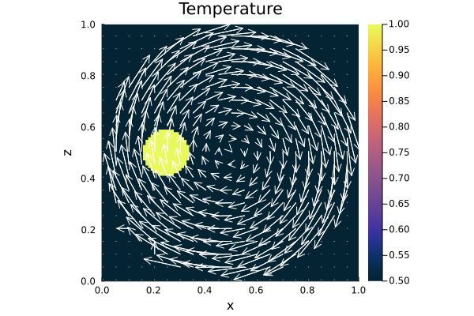
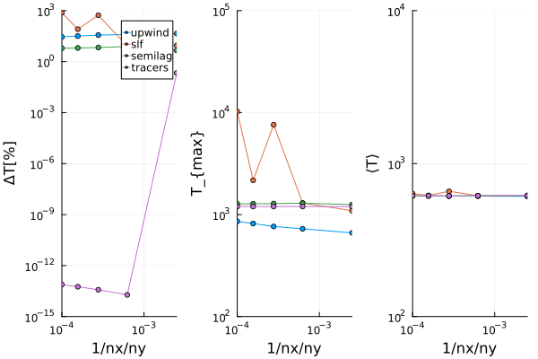

# [Advection; Resolution Test (2D)](https://github.com/GeoSci-FFM/GeoModBox.jl/blob/main/examples/AdvectionEquation/2D_Advection_ResolutionTest.jl)

This example presents a quasi-resolution test for the 2D advection schemes. The setup is the same as in the [2D advection example](Advection2D.md).

To evaluate the efficiency of each advection scheme as resolution increases, the script computes the following metrics: 

- the maximum deviation of advected temperature from the maximum initial temperature, 
- the maximum temperature, and 
- the mean temperature. 

The first quantity reflects the maximum information loss due to numerical diffusion during the advection process. As the resolution increases, all metrics are expected to converge toward their respective initial values. 

--- 

First one needs to load the required packages: 

```Julia 
using Plots, Interpolations, Statistics
using GeoModBox.AdvectionEquation.TwoD
using GeoModBox.InitialCondition, GeoModBox.Tracers.TwoD
using Base.Threads
using Printf
```

The following section defines the maximum resolution and the advection schemes to be tested. The maximum resolution is given by: 

$\begin{equation}
nx_{max} = nrnxny*nx_{ini}, 
\end{equation}$

where $nrnxny$ is a simple multiplication factor and $nx_{ini} = 20$ the initial resolution. The resolution in the vertical direction is set equal to that in the horizontal direction. 

```Julia
@printf("Running on %d thread(s)\n", nthreads())

nrnxny      =   10
Scheme      =   ["upwind","slf","semilag","tracers"]
ns          =   size(Scheme,1)
@show ns
save_fig    =   -1
```

The variable `save_fig` controls the plotting output of the script: 

- `save_fig = -1` -> only plot the final result
- `save_fig = 0` -> plot every figure (Not recommended for large resolutions!)
- `save_fig = 1` -> save the gif animation for each model

For every other value, no plot is shown. 

Next, initialize the statistical parameters used for the resolution analysis. 

```Julia
# Statistical Parameter ============================================== #
St      = (
    Δ           =   zeros(size(Scheme,1),nrnxny),    
    nxny        =   zeros(size(Scheme,1),nrnxny),
    Tmax        =   zeros(size(Scheme,1),nrnxny),
    Tmean       =   zeros(size(Scheme,1),nrnxny),    
)
# -------------------------------------------------------------------- #
```

The next step defines the initial conditions, model geometry, and constants for visualization. 

```Julia
# Define Initial Condition =========================================== #
# Temperature - 
#   1) circle, 2) gaussian, 3) block
# Velocity - 
#   1) RigidBody, 2) ShearCell
Ini         =   (T=:circle,V=:RigidBody,) 
# -------------------------------------------------------------------- #
# Model Constants ==================================================== #
M   =   (
    xmin    =   0.0,
    xmax    =   1.0,
    ymin    =   0.0,
    ymax    =   1.0,
)
# -------------------------------------------------------------------- #
# Plot constants ===================================================== #
Pl  =   (
    inc         =   5,
    sc          =   1.0e9,
    Minc        =   1, 
    Msz         =   0.2,
)
# -------------------------------------------------------------------- #
```

The simulation begins with a loop over the different advection schemes. 

```Julia
for m = 1:ns # Loop over advection schemes
    # Define Numerical Scheme ======================================== #
    FD          =   (Method     = (Adv=Scheme[m],),)    
    @printf("Advection Scheme: %s\n ",string(FD.Method.Adv))
    # ---------------------------------------------------------------- #
```

For each scheme, a nested loop is used to iterate over different grid resolutions. Within the loop, one needs to update the grid resolution and coordinates. 

```Julia
    for l = 1:nrnxny # Loop over differnet resolutions
        # Numerical Constants ======================================== #
        NC  =   (
            x       =   l*20,       # Number of horizontal centroids
            y       =   l*20,       # Number of vertical centroids
        )
        display(string("nx = ",NC.x,", ny = ",NC.y))
        NV =   (
            x       =   NC.x + 1,   # Number of horizontal vertices
            y       =   NC.y + 1,   # Number of vertical vertices
        )
        Δ   =   (
            x   =   (abs(M.xmin)+M.xmax)/NC.x,
            y   =   (abs(M.ymin)+M.ymax)/NC.y,
        )
        # ------------------------------------------------------------ #
        # Grid ======================================================= #
        x   =   (
            c       =   LinRange(M.xmin + Δ.x/2.0, M.xmax - Δ.x/2.0, NC.x),
            ce      =   LinRange(M.xmin - Δ.x/2.0, M.xmax + Δ.x/2.0, NC.x+2),
            v       =   LinRange(M.xmin, M.xmax , NV.x)    
        )
        y       = (
            c       =   LinRange(M.ymin + Δ.y/2.0, M.ymax - Δ.y/2.0, NC.y),
            ce      =   LinRange(M.ymin - Δ.x/2.0, M.ymax + Δ.x/2.0, NC.y+2),
            v       =   LinRange(M.ymin, M.ymax, NV.y),    
        )
        x1      =   ( 
            c2d     =   x.c .+ 0*y.c',
            v2d     =   x.v .+ 0*y.v', 
            vx2d    =   x.v .+ 0*y.ce',
            vy2d    =   x.ce .+ 0*y.v',
        )
        x   =   merge(x,x1)
        y1      =   (
            c2d     =   0*x.c .+ y.c',
            v2d     =   0*x.v .+ y.v',
            vx2d    =   0*x.v .+ y.ce',
            vy2d    =   0*x.ce .+ y.v',
        )
        y   =   merge(y,y1)
        # ------------------------------------------------------------ #
```

To enable visualization, the output path and filename for the animation are defined. In addition, memory is allocated for the required data fields. 

```Julia
        # Animationsettings =0======================================== #
        path        =   string("./examples/AdvectionEquation/Results/")
        anim        =   Plots.Animation(path, String[] )
        filename    =   string("2D_advection_",Ini.T,"_",Ini.V,
                                "_",FD.Method.Adv,"_",NC.x,"_",NC.y,
                                "_nth_",nthreads())
        # ------------------------------------------------------------ #
        # Array Initialization ======================================= #
        D       =   (
            T       =   zeros(Float64,(NC.x,NC.y)),
            T_ex    =   zeros(Float64,(NC.x+2,NC.y+2)),
            T_exo   =   zeros(Float64,(NC.x+2,NC.y+2)),
            vx      =   zeros(Float64,(NV.x,NV.y+1)),
            vy      =   zeros(Float64,(NV.x+1,NV.y)),    
            vxc     =   zeros(Float64,(NC.x,NC.y)),
            vyc     =   zeros(Float64,(NC.x,NC.y)),
            vc      =   zeros(Float64,(NC.x,NC.y)),
            wt      =   zeros(Float64,(NC.x,NC.y)),
            wte     =   zeros(Float64,(NC.x+2,NC.y+2)),
            wtv     =   zeros(Float64,(NV...)),
            Tmax    =   [0.0],
            Tmin    =   [0.0],
            Tmean   =   [0.0],
        )
```

Now, one can calculate the initial conditions. Here, the build-in functions for the initial temperature and velocity conditions, `IniTemperature!()` and `IniVelocity!()`, respectively, are used. For more informaion please refer to the [documentaion](../Ini.md). Following the velocity initialization, one can caluclate the velocity on the centroids. 

```Julia
        # Initial Condition ========================================== #
        # Temperature ---
        IniTemperature!(Ini.T,M,NC,Δ,D,x,y)
        if FD.Method.Adv == "slf"
            D.T_exo    .=  D.T_ex
        end
        # Velocity ---
        IniVelocity!(Ini.V,D,NV,Δ,M,x,y)        
        # Get the velocity on the centroids ---
        @threads for i = 1:NC.x
            for j = 1:NC.y
                D.vxc[i,j]  = (D.vx[i,j+1] + D.vx[i+1,j+1])/2
                D.vyc[i,j]  = (D.vy[i+1,j] + D.vy[i+1,j+1])/2
            end
        end
        @. D.vc        = sqrt(D.vxc^2 + D.vyc^2)
        # ------------------------------------------------------------ #
```

Now, one needs to define the time parameter. Here, the maximum time is set such that the one full rotation of the anomaly is achieved. 

```Julia
        # Time ======================================================= #
        T   =   ( 
            tmax    =   [0.0],  
            Δfac    =   1.0,    # Courant time factor, i.e. dtfac*dt_courant
            Δ       =   [0.0],
        )
        T.tmax[1]   =   π*((M.xmax-M.xmin)-Δ.x)/maximum(D.vc)   # t = U/v [ s ]
        T.Δ[1]      =   T.Δfac * minimum((Δ.x,Δ.y)) / 
                    (sqrt(maximum(abs.(D.vx))^2 + maximum(abs.(D.vy))^2))
        nt          =   ceil(Int,T.tmax[1]/T.Δ[1])
        # ------------------------------------------------------------ #
```

In case tracer are required one needs to initialize them in the following. For more information please refer to the [documentation](../Ini.md).

```Julia
        # Tracer Advection =========================================== #
        if FD.Method.Adv == "tracers"
            # Tracer Initialization ---
            nmx,nmy     =   3,3
            noise       =   1
            nmark       =   nmx*nmy*NC.x*NC.y
            Aparam      =   :thermal
            MPC         =   (
                c       =   zeros(Float64,(NC.x,NC.y)),
                v       =   zeros(Float64,(NV.x,NV.y)),
                th      =   zeros(Float64,(nthreads(),NC.x,NC.y)),
                thv     =   zeros(Float64,(nthreads(),NV.x,NV.y)),
            )
            MAVG        = (
                PC_th   =   [similar(D.wte) for _ = 1:nthreads()],  # per thread
                PV_th   =   [similar(D.wtv) for _ = 1:nthreads()],   # per thread
                wte_th  =   [similar(D.wte) for _ = 1:nthreads()],  # per thread
                wtv_th  =   [similar(D.wtv) for _ = 1:nthreads()],  # per thread
            )
            # MPC     =   merge(MPC,MPC1)
            Ma      =   IniTracer2D(Aparam,nmx,nmy,Δ,M,NC,noise,0,0)
            # RK4 weights ---
            rkw     =   1.0/6.0*[1.0 2.0 2.0 1.0]   # for averaging
            rkv     =   1.0/2.0*[1.0 1.0 2.0 2.0]   # for time stepping
            # Interpolate on centroids ---
            @threads for k = 1:nmark
                Ma.T[k] =   FromCtoM(D.T_ex, k, Ma, x, y, Δ, NC)
            end
            # Count marker per cell ---
            CountMPC(Ma,nmark,MPC,M,x,y,Δ,NC,NV,1)
        end
        # ------------------------------------------------------------ #
```

Let's visualize the initial condition first. 


```Julia
        # Visualize initial condition -------------------------------- #
        if FD.Method.Adv == "tracers"
            p = heatmap(x.c,y.c,(D.T./D.Tmax)',color=:thermal, 
                    aspect_ratio=:equal,xlims=(M.xmin, M.xmax), 
                    ylims=(M.ymin, M.ymax),clims=(0.5, 1.0),
                    colorbar=true,layout=(1,2),subplot=1)
            quiver!(p,x.c2d[1:Pl.inc:end,1:Pl.inc:end],
                    y.c2d[1:Pl.inc:end,1:Pl.inc:end],
                    quiver=(D.vxc[1:Pl.inc:end,1:Pl.inc:end].*Pl.sc,
                            D.vyc[1:Pl.inc:end,1:Pl.inc:end].*Pl.sc),        
                    color="white",layout=(1,2),subplot=1)
            heatmap!(p,x.c,y.c,MPC.c',color=:inferno, 
                    aspect_ratio=:equal,xlims=(M.xmin, M.xmax), ylims=(M.ymin, M.ymax),
                    colorbar=true,clims=(0.0, 18.0),title=:"Marker per cell",
                    layout=(1,2),subplot=2)
        else
            p = heatmap(x.c , y.c, (D.T./D.Tmax)', 
                    color=:thermal, colorbar=true, aspect_ratio=:equal, 
                    xlabel="x", ylabel="z", 
                    title="Temperature", 
                    xlims=(M.xmin, M.xmax), ylims=(M.ymin, M.ymax), 
                    clims=(0.5, 1.0))
            quiver!(p,x.c2d[1:Pl.inc:end,1:Pl.inc:end],y.c2d[1:Pl.inc:end,1:Pl.inc:end],
                    quiver=(D.vxc[1:Pl.inc:end,1:Pl.inc:end].*Pl.sc,
                            D.vyc[1:Pl.inc:end,1:Pl.inc:end].*Pl.sc),        
                    color="white")
        end
        if save_fig == 1
            Plots.frame(anim)
        elseif save_fig == 0
            display(p)
        end
        # ------------------------------------------------------------ #
```



**Figure 1. Initial condition.** Initial rigid body rotation setup including a circular shaped temperature anomaly. The temperature field is normalized by its maximum value so that the anomaly intensity equals one. 

Now, one can start the time loop and the advection. 

```Julia
        # Time Loop ================================================== #
        for i=2:nt
            #@printf("Time step: #%04d\n ",i) 

            if FD.Method.Adv == "upwind"
                upwindc2D!(D.T,D.T_ex,D.vxc,D.vyc,NC,T.Δ[1],Δ.x,Δ.y)
            elseif FD.Method.Adv == "slf"
                slfc2D!(D.T,D.T_ex,D.T_exo,D.vxc,D.vyc,NC,T.Δ[1],Δ.x,Δ.y)
            elseif FD.Method.Adv == "semilag"
                semilagc2D!(D.T,D.T_ex,D.vxc,D.vyc,[],[],x,y,T.Δ[1])
            elseif FD.Method.Adv == "tracers"
                # Advect tracers ---
                AdvectTracer2D(Ma,nmark,D,x,y,T.Δ[1],Δ,NC,rkw,rkv,1)
                # CountMPC(Ma,nmark,MPC,M,x,y,Δ,NC,i)
                CountMPC(Ma,nmark,MPC,M,x,y,Δ,NC,NV,i)
                
                # Interpolate temperature from tracers to grid ---
                Markers2Cells(Ma,nmark,MAVG.PC_th,D.T_ex,MAVG.wte_th,D.wte,x,y,Δ,Aparam,0)           
                D.T     .=  D.T_ex[2:end-1,2:end-1]
            end
            
            display(string("ΔT = ",((maximum(filter(!isnan,D.T))-D.Tmax[1])/D.Tmax[1])*100))

            # Plot Solution ---
            if mod(i,10) == 0 || i == nt
                if FD.Method.Adv == "tracers"
                    p = heatmap(x.c,y.c,(D.T./D.Tmax)',color=:thermal, 
                            aspect_ratio=:equal,xlims=(M.xmin, M.xmax), 
                            ylims=(M.ymin, M.ymax),clims=(0.5, 1.0),
                            colorbar=true,layout=(1,2),subplot=1)
                    quiver!(p,x.c2d[1:Pl.inc:end,1:Pl.inc:end],
                            y.c2d[1:Pl.inc:end,1:Pl.inc:end],
                            quiver=(D.vxc[1:Pl.inc:end,1:Pl.inc:end].*Pl.sc,
                                    D.vyc[1:Pl.inc:end,1:Pl.inc:end].*Pl.sc),        
                            color="white",layout=(1,2),subplot=1)
                    heatmap!(p,x.c,y.c,MPC.c',color=:inferno, 
                            aspect_ratio=:equal,xlims=(M.xmin, M.xmax), ylims=(M.ymin, M.ymax),
                            colorbar=true,clims=(0.0, 18.0),title=:"Marker per cell",
                            layout=(1,2),subplot=2)
                else
                    p = heatmap(x.c , y.c, (D.T./D.Tmax)', 
                            color=:thermal, colorbar=true, aspect_ratio=:equal, 
                            xlabel="x", ylabel="z", 
                            title="Temperature", 
                            xlims=(M.xmin, M.xmax), ylims=(M.ymin, M.ymax), 
                            clims=(0.5, 1.0))
                    quiver!(p,x.c2d[1:Pl.inc:end,1:Pl.inc:end],
                                y.c2d[1:Pl.inc:end,1:Pl.inc:end],
                                quiver=(D.vxc[1:Pl.inc:end,1:Pl.inc:end].*Pl.sc,
                                        D.vyc[1:Pl.inc:end,1:Pl.inc:end].*Pl.sc),        
                            color="white")
                end
                if save_fig == 1
                    Plots.frame(anim)
                elseif save_fig == 0
                    display(p)                        
                end
            end
                
        end # End Time loop
```

If wanted, a gif animation is generated in the following. 

```Julia
        # Save Animation ============================================= #
        if save_fig == 1
            # Write the frames to a GIF file
            Plots.gif(anim, string( path, filename, ".gif" ), fps = 15)
            foreach(rm, filter(startswith(string(path,"00")), readdir(path,join=true)))
        elseif save_fig == 0
            display(plot(p))
        end
        # Statistical Values for Each Scheme and Resolution ---
        St.Δ[m,l]       =   abs((maximum(filter(!isnan,D.T))-D.Tmax[1])/D.Tmax[1])*100
        St.nxny[m,l]    =   1/NC.x/NC.y
        St.Tmax[m,l]    =   maximum(filter(!isnan,D.T))
        St.Tmean[m,l]   =   mean(abs.(filter(!isnan,D.T)))
        # ------------------------------------------------------------ #

    end # End resolution loop

end # End method loop
```

Let's visualize and store the statistical parameters. 

```Julia
q   =   plot(0,0,layout=(1,3))
for m=1:ns    
    plot!(q,St.nxny[m,:],St.Δ[m,:],
                marker=:circle,markersize=3,label=Scheme[m],
                xaxis=:log,yaxis=:log,
                xlims=(minimum(St.nxny), maximum(St.nxny)), 
                ylims=(1e-15, 1e3), 
                xlabel="1/nx/ny",ylabel="ΔT[%]",layout=(1,3),
                subplot=1)
    plot!(q,St.nxny[m,:],St.Tmax[m,:],
                marker=:circle,markersize=3,label="",
                xaxis=:log,yaxis=:log,
                xlims=(minimum(St.nxny), maximum(St.nxny)), 
                ylims=(1e2, 1e5),
                xlabel="1/nx/ny",ylabel="T_{max}",
                subplot=2)
    plot!(q,St.nxny[m,:],St.Tmean[m,:],
                marker=:circle,markersize=3,label="",
                xaxis=:log,yaxis=:log,
                xlims=(minimum(St.nxny), maximum(St.nxny)), 
                ylims=(1e2, 1e4), 
                xlabel="1/nx/ny",ylabel="⟨T⟩",
                subplot=3)
    display(q)
end
# --------------------------------------------------------------------- #
# Save Final Figure =================================================== #
if save_fig == 1 || save_fig == -1
    savefig(q,string("./examples/AdvectionEquation/",
                        "Results/2D_advection_",Ini.T,"_",
                        Ini.V,"_ResTest.png"))
end
# --------------------------------------------------------------------- #
```

<!--  -->


**Figure 2. Advection Resolution Test.**  
Deviation, maximum, and mean temperature for each advection scheme across increasing grid resolutions. 