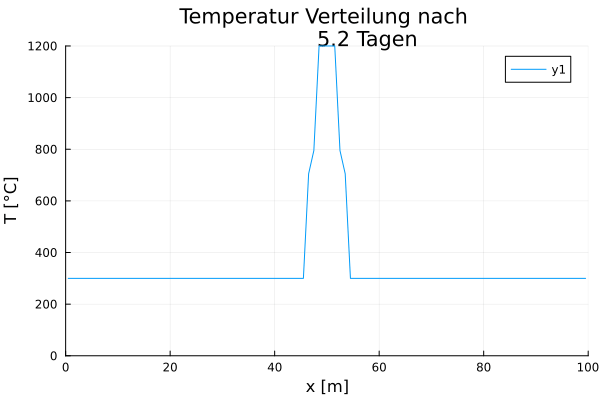

# [02 - 1D Heat Diffusion (explicit)](https://github.com/GeoSci-FFM/GeoModBox.jl/blob/main/exercises/02_1D_Heat_explicit_en.ipynb)

This exercise focuses on solving the one-dimensional heat diffusion equation without internal heat generation using the explicit (FTCS) scheme. The explicit formulation is particularly useful for illustrating stability constraints that do not arise in implicit methods.  

The main objectives are:  

1. Discretization of the PDE and approximation of derivatives with finite difference operators,  
2. Understanding and applying the diffusion time stability criterion,  
3. Exploring different approaches to implement the numerical scheme:  
   a) using a for-loop over the grid,  
   b) using array indexing to avoid explicit loops, and  
   c) employing predefined functions from `GeoModBox.jl`,  
4. Defining Dirichlet and Neumann boundary conditions, and  
5. Storing the solution as a GIF animation.  

The resulting transient evolution of a Gaussian temperature anomaly is shown in Figure 1.  

  

**Figure 1. Transient behavior of a one-dimensional Gaussian temperature anomaly.**
