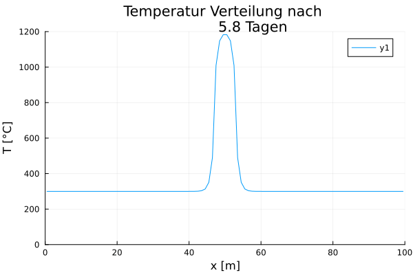

# [03 - 1D Heat Diffusion (implicit)](https://github.com/GeoSci-FFM/GeoModBox.jl/blob/main/exercises/03_1D_Heat_implicit_en.ipynb)

This exercise focuses on solving the one-dimensional heat diffusion equation without internal heat generation using the implicit (backward Euler) scheme. The implicit approach is unconditionally stable and thus avoids the restrictive time-step limitation of explicit methods. However, stability does not imply higher accuracy, and the scheme requires solving a linear system at each time step.  

The main objectives are:  

1. Discretization of the PDE and approximation of derivatives with finite difference operators,  
2. Defining Dirichlet and Neumann boundary conditions,  
3. Setting up the coefficient matrix,  
4. Exploring different approaches to implement the numerical scheme:  
   a) using a for-loop over the grid and solving the linear system with a direct method,  
   b) employing predefined functions from `GeoModBox.jl`, and  
   c) solving the linear system iteratively with the defect correction method,  
5. Storing the solution as a GIF animation.  

The resulting transient evolution of a Gaussian temperature anomaly is shown in Figure 1.  

  

**Figure 1. Transient behavior of a one-dimensional Gaussian temperature anomaly.**
