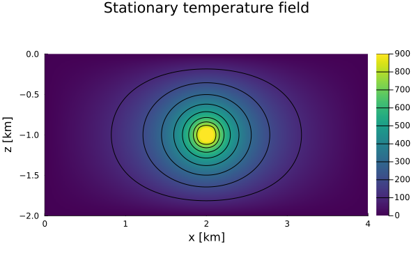

# [04 - 2D Heat Diffusion (stationary)](https://github.com/GeoSci-FFM/GeoModBox.jl/blob/main/exercises/04_2D_Diffusion_Stationary_en.ipynb)

This exercise focuses on solving the stationary two-dimensional heat diffusion equation with internal heat generation. The problem setup resembles a simplified model of localized heat sources, such as radioactive waste disposal in a salt dome. The stationary case is particularly useful for introducing matrix assembly and boundary-condition handling in two dimensions.  

The main objectives are:  

1. Formulating the stationary heat diffusion equation in two dimensions,  
2. Discretizing the equation on a structured grid using finite differences,  
3. Implementing boundary conditions (Dirichlet and Neumann) with ghost nodes,  
4. Assembling and solving the resulting linear system of equations, and  
5. Visualizing the stationary temperature field.  

The resulting stationary solution is illustrated in Figure 1.  

  

**Figure 1. Stationary two-dimensional temperature distribution.**
