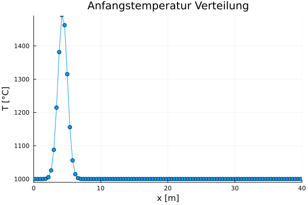

# [06 - 1D Advection (schemes & stability)](https://github.com/GeoSci-FFM/GeoModBox.jl/blob/main/exercises/06_1D_Advection_en.ipynb)

This exercise investigates the one-dimensional advection equation (pure transport, no diffusion) and compares several time–space discretizations on two initial conditions (Gaussian vs. block anomaly). The case highlights numerical **stability**, **diffusion**, and **dispersion** and how they depend on the scheme and the Courant number.

The main objectives are:

1. Formulate the 1D advection equation and the Courant–Friedrichs–Lewy (CFL) stability constraint.
2. Implement and compare multiple schemes:
   - FTCS (Forward Time–Centered Space) — note: unstable for pure advection,
   - Upwind (1st order), Downwind, Lax–Friedrichs,
   - Leapfrog (SLF), Semi-Lagrangian, and a tracer method.
3. Apply periodic boundary conditions using ghost cells and verify mass/shape transport.
4. Assess numerical diffusion/dispersion by contrasting results for a **Gaussian** (smooth) vs. **block** (sharp) profile.
5. Visualize the time evolution and simple diagnostics (e.g., peak amplitude).

An example animation of the evolving profile using the upwind scheme and the semi-lagrangian scheme is shown in Figure 1 and Figure 2, respectively.

**Figure 1.** Advection of Gaussian temperature anomaly using the upwind scheme.

**Figure 2.** Advection of Gaussian temperature anomaly using the semi-lagrangian scheme.