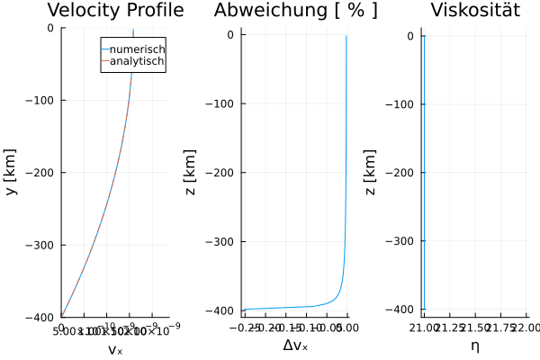

# [08 – 1D Stokes Equation](https://github.com/GeoSci-FFM/GeoModBox.jl/blob/main/exercises/08_1D_Stokes_en.ipynb)

This exercise focuses on solving the one-dimensional Stokes equation for a channel flow with both **constant** and **depth-dependent viscosity**. The problem setup allows direct comparison between the **analytical solution** and the **numerical approximation**, providing a way to test the accuracy of finite difference methods.  

The main objectives are:  

1. Deriving and discretizing the 1-D Stokes equation with finite difference operators,  
2. Defining viscosity profiles (constant and logarithmically varying with depth),  
3. Implementing **Dirichlet** and **Neumann** boundary conditions,  
4. Assembling and solving the linear system of equations,  
5. Comparing numerical and analytical solutions,  
6. Visualizing velocity profiles and the relative error.  

The resulting velocity distributions illustrate the difference between Couette and Couette–Poiseuille flow, and highlight the influence of variable viscosity on the channel flow solution.  

**Figure 1.** Solution of the 1-D Stokes problem. 

