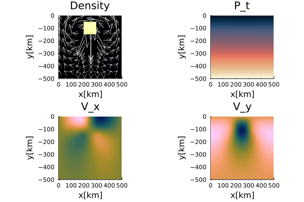

# [09 – Falling Block](https://github.com/GeoSci-FFM/GeoModBox.jl/blob/main/exercises/09_2D_Falling_Block_en.ipynb)

In this exercise, students simulate the motion of a dense block sinking in a viscous fluid under the influence of gravity. The problem is set up in two dimensions with constant viscosity (*isoviscous* case) and *free-slip* velocity boundary conditions on all sides.  

The goals of this exercise are to:  
- Set up the **2-D model geometry** and define the block phase within the background medium.  
- Assign appropriate **physical parameters**, such as viscosity, density contrast, and gravity.  
- Implement the **momentum and mass conservation equations** using the finite difference method.  
- Assemble and solve the resulting **linear system of equations** for velocities and pressure.  
- Visualize the **velocity field** and the interaction between the sinking block and the surrounding viscous medium.  

This exercise provides a simple but powerful benchmark problem to validate the Stokes solver and to understand the dynamics of density-driven flow in an isoviscous medium.  

