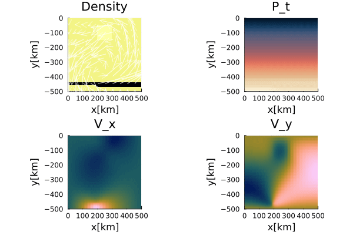

# [10 – 2D Falling Block (time-dependent)](https://github.com/GeoSci-FFM/GeoModBox.jl/blob/main/exercises/10_2D_Falling_Block_td_en.ipynb)

This exercise extends the **falling block problem** to a **time-dependent** case with constant viscosity.  
The problem couples the solution of the **momentum conservation equation** (Stokes system) with the **advection equation**, where density (or phase) is transported through the velocity field.  

The main objectives are:  

1. Setting up the model domain with a dense block embedded in a viscous medium under gravity,  
2. Defining **free-slip** velocity boundary conditions on all sides,  
3. Assembling the coefficient matrix for the Stokes system (constant viscosity → assembled once),  
4. Implementing a **time loop** that in each step:  
   - Updates the right-hand side with the current density distribution,  
   - Solves the Stokes system for velocity and pressure,  
   - Advects density (or phase) using different numerical schemes, including tracers,  
   - Recomputes the time step and visualizes the solution,  
5. Producing an animation of the sinking block over time.  

This problem demonstrates how to couple **Stokes flow** with **advection of material properties**, and how the choice of advection scheme affects the evolution of the solution.  

**Figure 1.** Time evolution of the sinking block in a viscous medium using the tracer advection method.  
