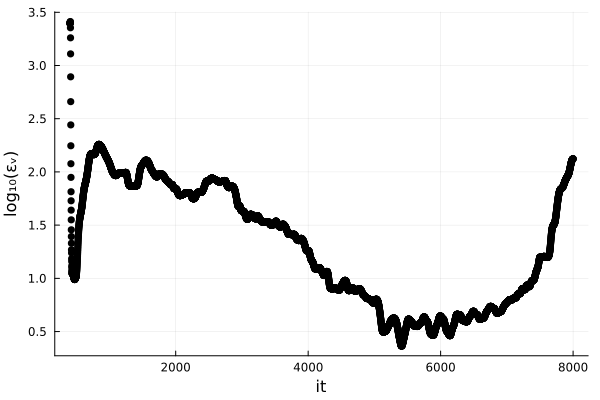

# [12 – 2D Thermal Convection (scaled)](https://github.com/GeoSci-FFM/GeoModBox.jl/blob/main/exercises/12_2D_Thermal_Convection_scaled_en.ipynb)

This exercise revisits **2-D thermal convection** in a fully **nondimensional** (scaled) framework. You will define scaling constants and transform the governing equations, and study how the flow depends on the **Rayleigh number**. The setup follows the **Boussinesq approximation** with isoviscous rheology and bottom heating.

**Objectives**

1. Define physically motivated **scaling constants** and apply the **nondimensional transformations** to the PDEs.  
2. Formulate the **dimensionless** energy, momentum, and mass conservation equations (incl. buoyancy term $Ra,T'$).  
3. Implement boundary conditions (Dirichlet/Neumann for temperature; **free-slip** for velocity).  
4. Solve the coupled system using finite differences (advection + diffusion + Stokes), leveraging GeoModBox solvers.  
5. Run and compare models for **$Ra = 10^4, 10^5, 10^6$**; discuss plume/slab scale and flow vigor.  
6. Compute diagnostics such as **Nusselt number** and **RMS velocity**; assess approach to steady state.

As the Rayleigh number increases:

- **flow velocities** increase,  
- **convection becomes more vigorous**, and  
- structures such as *slabs* and *plumes* become **finer**.

Therefore, the **grid resolution** must be adjusted accordingly to ensure **numerical stability** and **accuracy**.

> However, higher resolution significantly increases computational cost!

The resolution provided here is sufficient for the Rayleigh numbers listed.  
That said, some numerical methods already show **initial inaccuracies**, so in practice a **higher resolution** is often advisable.

**Figure 1.** Isoviscous, bottom-heated thermal convection for $Ra = 10^6$ with a resolution of 150x50. The initial condition is a linearly increasing temperature profile with an elliptical anomaly at the top. Thermal boundary conditions are fixed temperature at the top and bottom and zero heat flux at the sides. All velocity boundary conditions are free slip. Heat diffusion is solved using the Crank–Nicolson method, the Stokes equation using the defect correction method, and temperature advection with the semi-Lagrangian method. Models run until a steady state is reached or up to a maximum of 8000 iterations.  

**Figure 2.** Time series of the surface Nusselt number and the root mean square velocity. For details on how these diagnostics are calculated, see the [exercise](https://github.com/GeoSci-FFM/GeoModBox.jl/blob/main/exercises/12_2D_Thermal_Convection_en.ipynb).  

**Figure 3.** Variation in the root mean square velocity with numerical iterations. Empirically, a tolerance of $3.8^{-3}$ was chosen to define steady state. Low-$Ra$ cases typically reach steady state in fewer than 3000 iterations.  