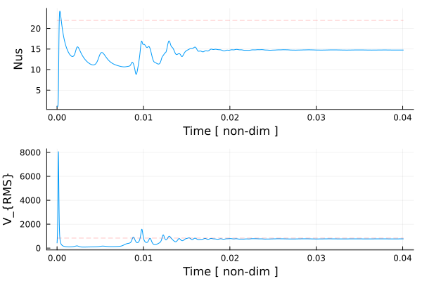
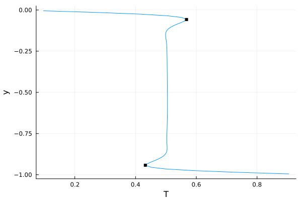

# [13 – Blankenbach Benchmark](https://github.com/GeoSci-FFM/GeoModBox.jl/blob/main/exercises/13_Blankenbach_Benchmark_en.ipynb)

This exercise introduces the **Blankenbach benchmark** (Blankenbach et al., 1989), a widely used reference test for validating numerical models of **mantle convection**. The benchmark compares results from different numerical methods by providing reference values for the **steady-state Nusselt number** and **mean velocity** at various Rayleigh numbers.

The setup consists of a **2-D rectangular box** with an aspect ratio of 1:1 (height = length = 1000 km). All boundaries are **free-slip**, while thermal boundary conditions are **fixed temperatures** at the top and bottom and **zero heat flux** along the sides. Density varies linearly with temperature according to the **Boussinesq approximation**.

The main objectives are:

1. Implementing a **steady-state 2-D isoviscous convection model** under the Boussinesq approximation,  
2. Computing thermal convection for three different **Rayleigh numbers** ($Ra = 10^4, 10^5, 10^6$),  
3. Comparing the computed **Nusselt numbers** and **mean velocities** with the published benchmark values,  
4. Performing a **resolution test** to assess the convergence of numerical results, and  
5. Discussing deviations and numerical stability at higher Rayleigh numbers.

This benchmark demonstrates how increasing the Rayleigh number strengthens convection, leading to thinner thermal boundary layers and more localized upwellings and downwellings. It also highlights the importance of numerical resolution and stability in high–Rayleigh-number simulations.

**Figure 1.** Isoviscous, bottom-heated thermal convection for $Ra = 10^6$ with a resolution of 100×100.  
The initial condition is a linearly increasing temperature profile with an elliptical anomaly at the top.  
The background color shows the non-dimensional temperature, overlaid by temperature isolines (every 0.05) and centroid velocity vectors. Heat diffusion is solved using the **Crank–Nicolson** method, the Stokes equation using the **defect correction** method, and temperature advection with the **semi-Lagrangian** method.  
Models run until a steady state is reached or up to a maximum of 8000 iterations.

**Figure 2.** Time series of the surface Nusselt number and root-mean-square (RMS) velocity. The steady-state benchmark values are shown as red dashed lines. For details on how these diagnostics are calculated, see the [exercise](https://github.com/GeoSci-FFM/GeoModBox.jl/blob/main/exercises/13_Blankenbach_Benchmark_en.ipynb).

**Figure 3.** Vertical temperature profile at the center of the model domain. Benchmark values for the local maximum and minimum temperatures are shown as black squares.

**Figure 4.** Variation in root-mean-square velocity with numerical iterations. Empirically, a tolerance of $3.8^{-3}$ was chosen to define steady state. Low-$Ra$ cases typically reach steady state in fewer than 3000 iterations.
